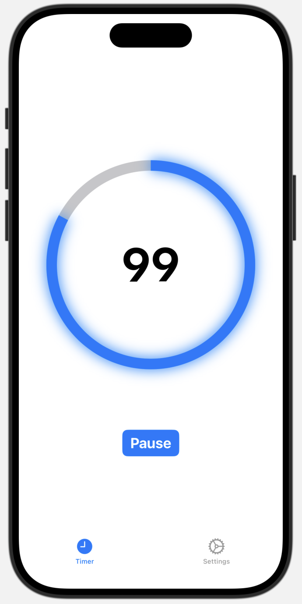

# BrushTimer

## Preview

## Information
- This is a simple SwiftUI toothbrushing timer for counting down and recording data to the Health app using HealthKit.
- Supports basic functions such as pausing, canceling, and changing timer ring colors.

## Usage
Open the project in Xcode and run with either a Simulator instance or a physical device with Developer Mode enabled as a destination.
